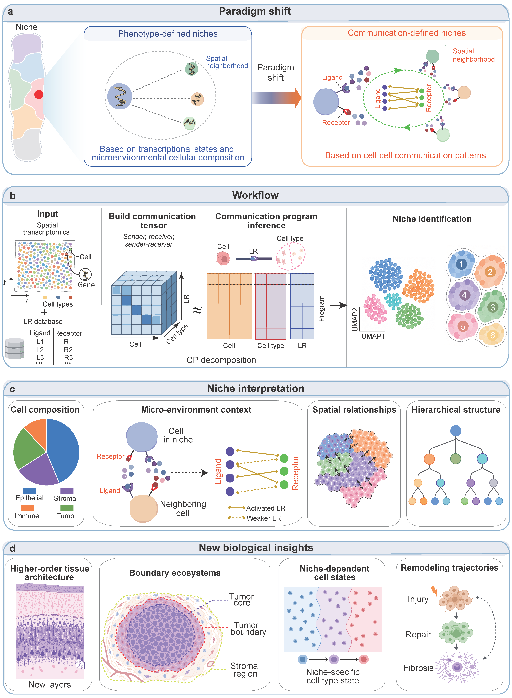

<h1> <p align="center">
    Intercellular communication defines cellular niches across tissues
</p> </h1>


**CommuNiche**, a computational framework that identifies cellular niches from intercellular communication patterns in spatial transcriptomics data. 
By modeling ligand--receptor signaling within local neighborhoods, CommuNiche maps cells into a communication space in which niches emerge as recurrent multicellular communication states. 
This representation enables systematic dissection and comparison of tissue microenvironments across biological contexts. 

<p align="center">
   
</p>

### Installation

**CommuNiche** has been developed and tested on **Ubuntu 18.04.2 LTS and Window 11 x64**.

To install **CommuNiche**, please follow these steps:

1. **Set up a Conda environment for CommuNiche**:

    ```bash
    conda env create -f environment.yml
    conda activate CommuNiche
    ```

    In this step, we install all the requirments for CommuNiche


2. **Clone the repository and install Spot2Cell**:

    ```bash
    git clone https://github.com/keyalone/CommuNiche.git
    cd CommuNiche
    pip install .
    ```

3. **Verify the installation in Python**:

    ```python
    import CommuNiche 
    ```

## Reproducibility
To facilitate usability and reproducibility of our results, we have uploaded all data used in this study to [Zenodo](https://zenodo.org/records/15458645) for public access.

We provide source codes for reproducing the CommuNiche analysis in the main text in the `demos` directory.

- [Preprocessing pipeline for HER2-positive breast cancer](demos/Preprocessing_pipeline_for_G2.ipynb)
- [Preprocessing pipeline for human prostate cancer](demos/Preprocessing_pipeline_for_PC.ipynb)
- [Reconstruction of single-cell spatial maps for HER2-positive breast cancer](demos/HER2-positive_Reproducibility.ipynb)
- [CCI analysis in in-situ cancer for HER2-positive breast cancer](CCI_analysis_in_in-situ_cancer_for_G2.html)
- [Reconstruction of single-cell spatial maps for visium prostate cancer](demos/Visium_Prostate_Reproducibility.ipynb)
- [Differential CCI and pseudotime analysis for visium prostate cancer](demos/DifferentialCCI_Pseudotime_for_PC.html)

 
## Contact information
Please do not hesitate to contact Dr. Hui-Sheng Li (<lihs@mails.ccnu.edu.cn>) or Prof. Xiao-Fei Zhang (<zhangxf@ccnu.edu.cn>) to seek any clarifications regarding any contents.